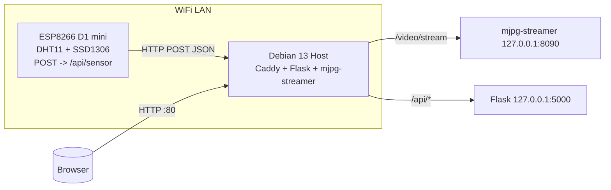

# Debian 13 + USB Webcam + ESP8266 Grow Station

This project sets up a complete grow station monitoring system on Debian 13 (headless) with an ESP8266 sensor node (D1 mini).

## Features

- **Caddy** web server (serves dashboard, reverse proxy)
- **Python Flask API** for storing/reading sensor data
- **mjpg-streamer** for USB webcam live streaming
- **Simple HTML/JS Dashboard** (temperature, humidity, video stream)
- **ESP8266 Firmware** (PlatformIO) with DHT11 and SSD1306 OLED

> **Note**: Placeholders NOT to be replaced in source code: `<GPIO_DHT>`, `<GPIO_OLED_SDA>`, `<GPIO_OLED_SCL>`, `<SERVER_IP>`, `<SSID>`, `<WIFI_PASSWORD>`

## System Architecture



## Project Structure

```
/debian/         # Debian-specific files (systemd, Caddyfile, scripts)
  /systemd/      # systemd service units
  Caddyfile      # Caddy web server configuration
  deploy.sh      # Automated deployment script
  status.sh      # Service status checker
  uninstall.sh   # Cleanup script
/api/            # Flask API (GET/POST /api/sensor)
/dashboard/      # Static dashboard (HTML/CSS/JS)
/esp8266/        # PlatformIO project for D1 mini
```

## Quick Start - Automated Installation

The easiest way to deploy on a fresh Debian 13 system:

```bash
# 1. Clone this repository
git clone https://github.com/NyxFox/dankplant.git /opt/grow-station
cd /opt/grow-station

# 2. Run the automated deployment script as root
sudo bash debian/deploy.sh
```

The script will:
- Install all required packages (caddy, python3, mjpg-streamer, etc.)
- Create system users and directories
- Deploy Flask API with Python virtual environment
- Install systemd services
- Configure and start all services
- Display access URLs

After deployment, access your system at:
- **Dashboard**: `http://<your-ip>/`
- **API Health**: `http://<your-ip>/api/health`
- **Sensor Data**: `http://<your-ip>/api/sensor`
- **Video Stream**: `http://<your-ip>/video/stream/?action=stream`

## Manual Installation (Step by Step)

If you prefer manual control over the installation:

### 1. Install Required Packages

```bash
sudo apt-get update
sudo apt-get install -y caddy python3 python3-pip python3-venv mjpg-streamer v4l-utils git curl
```

### 2. Create System User

```bash
sudo useradd --system --no-create-home --shell /usr/sbin/nologin --comment "Grow Station Service" grow
```

### 3. Create Directories

```bash
sudo install -d -m 0755 -o root -g root /var/www/html
sudo install -d -m 0755 -o grow -g grow /opt/grow/api
sudo install -d -m 0755 -o grow -g grow /var/log/grow
sudo install -d -m 0755 -o video -g video /var/log/mjpg-streamer
sudo install -d -m 0755 -o grow -g grow /var/www/data
sudo install -d -m 0755 -o root -g root /etc/caddy
```

### 4. Deploy Flask API

```bash
# Copy API files
sudo cp -r api/* /opt/grow/api/
sudo chown -R grow:grow /opt/grow/api

# Create Python virtual environment
cd /opt/grow/api
sudo -u grow python3 -m venv .venv
sudo -u grow .venv/bin/pip install --upgrade pip
sudo -u grow .venv/bin/pip install -r requirements.txt
```

### 5. Install systemd Services

```bash
# Copy service files
sudo cp debian/systemd/flask-api.service /etc/systemd/system/
sudo cp debian/systemd/mjpg-streamer.service /etc/systemd/system/

# Reload systemd
sudo systemctl daemon-reload

# Enable and start services
sudo systemctl enable flask-api.service
sudo systemctl enable mjpg-streamer.service
sudo systemctl start flask-api.service
sudo systemctl start mjpg-streamer.service
```

### 6. Configure Caddy

```bash
# Copy Caddyfile
sudo cp debian/Caddyfile /etc/caddy/Caddyfile

# Deploy dashboard
sudo cp -r dashboard/* /var/www/html/

# Enable and start Caddy
sudo systemctl enable caddy.service
sudo systemctl restart caddy.service
```

## Service Management

### Check Service Status

```bash
# Quick status check for all services
bash debian/status.sh

# Or check individual services
sudo systemctl status flask-api
sudo systemctl status mjpg-streamer
sudo systemctl status caddy
```

### View Logs

```bash
# Follow logs in real-time
sudo journalctl -u flask-api -f
sudo journalctl -u mjpg-streamer -f
sudo journalctl -u caddy -f

# View recent logs
sudo journalctl -u flask-api -n 50
```

### Restart Services

```bash
sudo systemctl restart flask-api
sudo systemctl restart mjpg-streamer
sudo systemctl restart caddy
```

### Stop/Start Services

```bash
sudo systemctl stop flask-api
sudo systemctl start flask-api
```

## ESP8266 Firmware (D1 mini)

### Prerequisites

- PlatformIO (VS Code extension or CLI)
- D1 mini board with USB cable

### Flashing Instructions

1. **Copy configuration template**:
   ```bash
   cp esp8266/include/config.h.example esp8266/include/config.h
   ```

2. **Edit `esp8266/include/config.h`** and fill in:
   - `<SSID>` - Your WiFi network name
   - `<WIFI_PASSWORD>` - Your WiFi password
   - `<SERVER_IP>` - IP address of your Debian server
   - `<GPIO_DHT>` - GPIO pin for DHT11 sensor (e.g., D4)
   - `<GPIO_OLED_SDA>` - GPIO pin for OLED SDA (e.g., D2)
   - `<GPIO_OLED_SCL>` - GPIO pin for OLED SCL (e.g., D1)

3. **Flash the firmware**:
   ```bash
   cd esp8266
   pio run --target upload
   ```

4. **Monitor serial output**:
   ```bash
   pio device monitor
   ```

### Sensor Data Format

The ESP8266 sends JSON data every 10 seconds:

```json
{
  "device": "esp8266-grow-controller-01",
  "temp_c": 24.8,
  "humidity": 58,
  "timestamp": 1731809160,
  "rssi": -61
}
```

## Camera Configuration

### Check Available Cameras

```bash
v4l2-ctl --list-devices
ls -l /dev/video*
```

### Test Camera Capabilities

```bash
v4l2-ctl --device=/dev/video0 --list-formats-ext
```

### Adjust Camera Settings

If you need different resolution or framerate, edit `/etc/systemd/system/mjpg-streamer.service`:

```ini
ExecStart=/usr/bin/mjpg_streamer \
    -i "/usr/lib/x86_64-linux-gnu/mjpg-streamer/input_uvc.so -d /dev/video0 -r 1920x1080 -f 30" \
    -o "/usr/lib/x86_64-linux-gnu/mjpg-streamer/output_http.so -w /usr/share/mjpg-streamer/www -p 8090 -l 127.0.0.1"
```

Then reload:
```bash
sudo systemctl daemon-reload
sudo systemctl restart mjpg-streamer
```

## Troubleshooting

### No Sensor Data

**Problem**: `/api/sensor` returns "No sensor data yet"

**Solution**: Wait for ESP8266 to make its first POST request. Check ESP8266 serial monitor for connection issues.

### Permission Errors

**Problem**: API can't write to `/var/www/data/sensor.json`

**Solution**: Ensure proper ownership:
```bash
sudo chown grow:grow /var/www/data
sudo chmod 755 /var/www/data
```

### MJPG Streamer Not Starting

**Problem**: `mjpg-streamer.service` fails to start

**Solutions**:
1. Check if camera is connected: `ls -l /dev/video0`
2. Check user permissions: `sudo usermod -a -G video $USER`
3. Verify plugin paths exist:
   ```bash
   ls /usr/lib/x86_64-linux-gnu/mjpg-streamer/
   ```
4. Check logs: `sudo journalctl -u mjpg-streamer -n 50`

### Caddy Not Binding to Port 80

**Problem**: Caddy fails with "address already in use"

**Solution**: Check for conflicting services:
```bash
sudo netstat -tulpn | grep :80
sudo systemctl stop apache2  # if Apache is installed
sudo systemctl disable apache2
```

### Flask API 500 Errors

**Problem**: API returns internal server errors

**Solutions**:
1. Check logs: `sudo journalctl -u flask-api -n 50`
2. Verify Python dependencies: `cd /opt/grow/api && .venv/bin/pip list`
3. Test manually:
   ```bash
   sudo -u grow /opt/grow/api/.venv/bin/python /opt/grow/api/app.py
   ```

### ESP8266 Can't Connect

**Problem**: ESP8266 shows WiFi connection errors

**Solutions**:
1. Verify SSID and password in `config.h`
2. Check WiFi signal strength
3. Ensure 2.4GHz WiFi (ESP8266 doesn't support 5GHz)
4. Check server IP is correct
5. Monitor serial output: `pio device monitor`

## Security Considerations

### Current Setup (Development/LAN Only)

- Caddy listens on port 80 (HTTP only, no TLS)
- API has no authentication
- CORS allows all origins (`*`)
- Suitable for trusted LAN environments only

### Production Hardening

For internet-exposed deployments:

1. **Enable HTTPS in Caddy**:
   ```caddy
   yourdomain.com {
       # Caddy will automatically get Let's Encrypt certificate
       # ... rest of config
   }
   ```

2. **Add API Authentication**:
   - Implement API key authentication
   - Use Flask-HTTPAuth or similar
   - Restrict CORS origins

3. **Firewall Configuration**:
   ```bash
   sudo apt-get install ufw
   sudo ufw allow 22/tcp    # SSH
   sudo ufw allow 80/tcp    # HTTP
   sudo ufw allow 443/tcp   # HTTPS
   sudo ufw enable
   ```

4. **Restrict CORS** in `api/app.py`:
   ```python
   resp.headers["Access-Control-Allow-Origin"] = "https://yourdomain.com"
   ```

## Performance Tuning

### Gunicorn Workers

Adjust workers in `/etc/systemd/system/flask-api.service`:
```ini
ExecStart=/opt/grow/api/.venv/bin/gunicorn \
    --workers 4 \  # Increase for more concurrent requests
    --bind 127.0.0.1:5000 \
    app:app
```

### Camera Performance

For lower bandwidth/CPU usage:
- Reduce resolution: `-r 640x480`
- Reduce framerate: `-f 10`
- Adjust quality: Add `-q 50` (lower = more compression)

## Uninstallation

To completely remove the Grow Station:

```bash
sudo bash debian/uninstall.sh
```

This will:
- Stop and disable all services
- Remove application files
- Clean up logs
- Optionally remove the `grow` user

Packages (caddy, mjpg-streamer, python3) are NOT removed. To remove them:
```bash
sudo apt-get remove caddy mjpg-streamer
```

## API Endpoints

### GET /api/health
Health check endpoint

**Response**:
```json
{"status": "up"}
```

### GET /api/sensor
Retrieve latest sensor data

**Response** (success):
```json
{
  "device": "esp8266-grow-controller-01",
  "temp_c": 24.8,
  "humidity": 58,
  "timestamp": 1731809160,
  "rssi": -61,
  "timestamp_server": 1731809165
}
```

**Response** (no data yet):
```json
{
  "status": "empty",
  "message": "No sensor data yet",
  "timestamp_server": 1731809165
}
```

### POST /api/sensor
Store new sensor data (called by ESP8266)

**Request**:
```json
{
  "device": "esp8266-grow-controller-01",
  "temp_c": 24.8,
  "humidity": 58,
  "timestamp": 1731809160,
  "rssi": -61
}
```

**Response**:
```json
{"status": "ok"}
```

## Contributing

Feel free to submit issues and pull requests for improvements!

## License

This project is provided as-is for educational and personal use.
# dankplant
