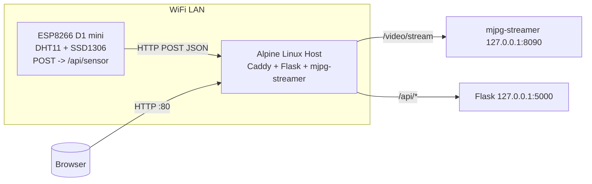

# DEPRECATED - Alpine Linux Version

⚠️ **This documentation is for the old Alpine Linux version.**

**The project has been migrated to Debian 13. Please see the main README.md in the root directory for current instructions.**

---

# Alpine Linux + USB Webcam + ESP8266 Grow Station (Legacy)

Dieses Projekt richtet eine kleine, ressourcenschonende Grow-Station auf einem Alpine Linux Host (z. B. IGEL M340C) mit einem ESP8266 Sensor-Node (D1 mini) ein.

- Caddy Webserver (liefert Dashboard, reverse proxy)
- Python Flask API zum Speichern/Lesen der Sensordaten
- mjpg-streamer für USB-Webcam
- Einfaches HTML/JS Dashboard (Temperatur, Luftfeuchte, Livestream)
- ESP8266 Firmware (PlatformIO) mit DHT11 und SSD1306 OLED

> Platzhalter NICHT ersetzen in den Quellen: `<GPIO_DHT>`, `<GPIO_OLED_SDA>`, `<GPIO_OLED_SCL>`, `<SERVER_IP>`, `<SSID>`, `<WIFI_PASSWORD>`

## Struktur

```
/alpine/         # Caddyfile + OpenRC Dienste
/api/            # Flask API (GET/POST /api/sensor)
/dashboard/      # Statisches Dashboard (HTML/CSS/JS)
/mjpg/           # Hinweise + conf.d für mjpg-streamer
/esp8266/        # PlatformIO Projekt für D1 mini
/docs/           # Dieses README
```

## Netzwerkdiagramm



## Alpine Setup (als root)

Pakete installieren:

```sh
apk add --no-cache caddy python3 py3-pip mjpg-streamer
```

Benutzer/Verzeichnisse (optional minimal):

```sh
adduser -D -H -s /sbin/nologin grow || true
install -d -m 0755 -o root -g root /var/www/html
install -d -m 0755 -o grow -g grow /opt/grow/api
install -d -m 0755 -o grow -g grow /var/log/grow
install -d -m 0755 -o root -g root /var/www/data
```

### Flask API deployen

```sh
# Dateien kopieren
cp -r api/* /opt/grow/api/
cd /opt/grow/api
python3 -m venv .venv
. .venv/bin/activate
pip install --no-cache-dir -r requirements.txt

# OpenRC Service
install -m 0755 alpine/openrc/flask-api /etc/init.d/flask-api
install -m 0644 alpine/openrc/conf.d/flask-api /etc/conf.d/flask-api
rc-update add flask-api default
rc-service flask-api start
```

### Caddy konfigurieren

```sh
# Caddyfile
install -d -m 0755 -o root -g root /etc/caddy
cp alpine/Caddyfile /etc/caddy/Caddyfile

# Dashboard deployen
cp -r dashboard/* /var/www/html/

# OpenRC (entweder Paketdienst verwenden oder optionalen Dienst hier)
# Paketdienst:
rc-update add caddy default
rc-service caddy start

# Optionaler eigener Dienst (nur falls benötigt):
# install -m 0755 alpine/openrc/caddy /etc/init.d/caddy
# install -m 0644 alpine/openrc/conf.d/caddy /etc/conf.d/caddy
# rc-update add caddy default
# rc-service caddy start
```

### mjpg-streamer

```sh
# Service
install -m 0755 alpine/openrc/mjpg-streamer /etc/init.d/mjpg-streamer
install -m 0644 mjpg/conf.d/mjpg-streamer /etc/conf.d/mjpg-streamer
rc-update add mjpg-streamer default
rc-service mjpg-streamer start
```

Prüfen:

- Stream im Browser: `http://<SERVER_IP>/video/stream/?action=stream`
- API Health: `http://<SERVER_IP>/api/health`
- Sensor JSON: `http://<SERVER_IP>/api/sensor`

## ESP8266 Firmware (D1 mini)

Voraussetzungen: PlatformIO (VS Code).

1. Datei `esp8266/include/config.h.example` kopieren zu `esp8266/include/config.h`.
2. Platzhalter in `include/config.h` ausfüllen (SSID, Passwort, Pins, Server-IP). Pins bleiben als Platzhalter wenn Sie erst später löten; Code kompiliert trotzdem, misst dann jedoch nichts.
3. Board: D1 mini ist bereits in `platformio.ini` konfiguriert (`board = d1_mini`).
4. Flashen über USB.

Messintervall: 10 s. Retry beim POST bis zu 3x. NTP via `configTime()`.

## JSON Schema

```json
{
  "device": "esp8266-grow-controller-01",
  "temp_c": 24.8,
  "humidity": 58,
  "timestamp": 1731809160,
  "rssi": -61
}
```

## OpenRC Hinweise

- Dienste aktivieren: `rc-update add <dienst> default`
- Start/Stop/Status: `rc-service <dienst> start|stop|status`

## Fehlerbehebung

- `sensor.json` nicht vorhanden? Erst schreiben, dann lesen: Warten bis der ESP das erste Mal postet.
- Rechte auf `/var/www/data`: Der API-Dienst-User (z. B. `grow`) braucht Schreibrechte. Dieses README setzt entsprechende `install`-Befehle ein.
- mjpg-streamer keine Frames: `v4l2-ctl --list-formats-ext` prüfen und Auflösung/FPS anpassen.
- CORS: API erlaubt `*`. Bei Bedarf einschränken.

## Sicherheit

- Caddy lauscht hier auf Port 80 (ohne TLS). Für Internetzugriff: TLS aktivieren oder nur im LAN nutzen.
- API schreibt einfache JSON-Datei, keine Auth. Für WAN-Nutzung unbedingt AuthN/Z hinzufügen.
